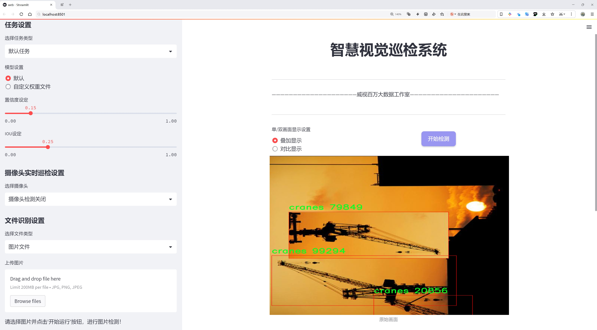
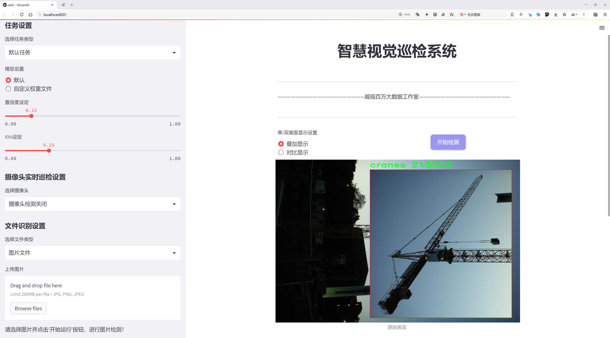
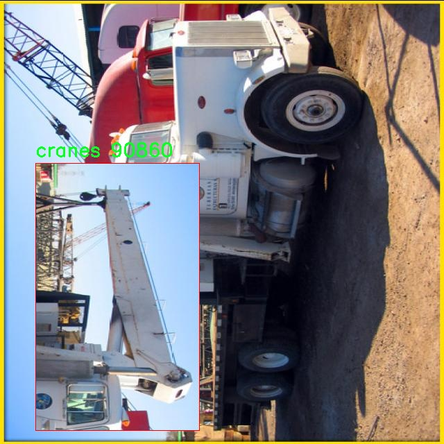
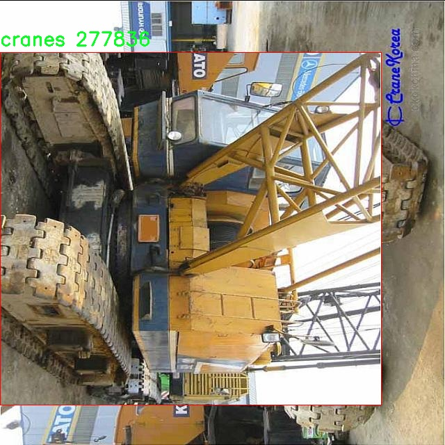
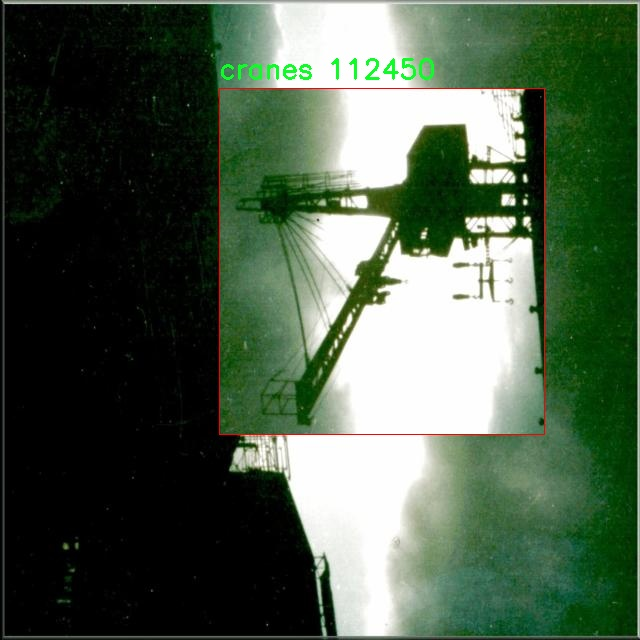
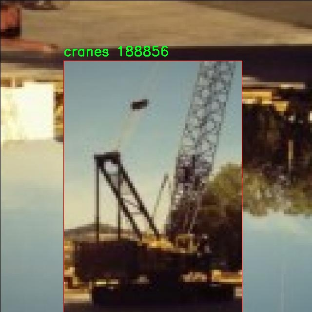
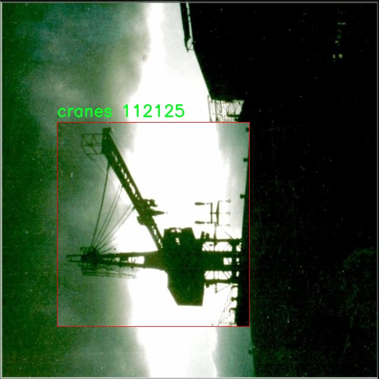

# 起重机检测检测系统源码分享
 # [一条龙教学YOLOV8标注好的数据集一键训练_70+全套改进创新点发刊_Web前端展示]

### 1.研究背景与意义

项目参考[AAAI Association for the Advancement of Artificial Intelligence](https://gitee.com/qunshansj/projects)

项目来源[AACV Association for the Advancement of Computer Vision](https://gitee.com/qunmasj/projects)

研究背景与意义

随着工业化进程的加快，起重机作为重型机械设备在建筑、港口、物流等领域的应用愈发广泛。起重机的高效、安全操作直接关系到工程进度和作业安全，因此，实时监测和管理起重机的状态显得尤为重要。传统的人工监测方式不仅效率低下，而且容易受到人为因素的影响，导致监测结果的不准确性。为了解决这一问题，基于计算机视觉的自动化检测系统应运而生，其中，目标检测技术作为实现这一目标的核心手段，逐渐引起了研究者的广泛关注。

YOLO（You Only Look Once）系列模型因其高效的实时检测能力而被广泛应用于各种目标检测任务。YOLOv8作为该系列的最新版本，进一步提升了检测精度和速度，适用于复杂环境下的目标识别。然而，尽管YOLOv8在多种场景中表现出色，但在特定应用领域，尤其是起重机检测方面，仍存在一些挑战。例如，起重机在不同光照、天气条件下的外观变化，以及在复杂背景中的遮挡问题，都会影响检测的准确性。因此，针对起重机的特征进行模型的改进和优化，具有重要的研究价值和实际意义。

本研究旨在基于改进的YOLOv8模型，构建一个高效的起重机检测系统。我们将利用1800张包含起重机的图像数据集，进行模型训练和测试。该数据集专注于起重机这一单一类别，提供了良好的训练基础。通过对数据集的深入分析，我们将提取起重机的特征信息，设计适合的改进策略，以提高模型在特定场景下的检测性能。此外，研究还将探讨如何通过数据增强、迁移学习等技术，进一步提升模型的泛化能力，以应对不同环境下的起重机检测需求。

在实际应用中，基于改进YOLOv8的起重机检测系统将为工程管理人员提供实时监测工具，帮助其及时发现和处理潜在的安全隐患，降低事故发生的风险。同时，该系统的推广应用也将推动智能化监测技术在重型机械领域的普及，提升行业的整体安全管理水平。通过本研究，我们期望能够为起重机的智能检测提供新的思路和方法，推动相关领域的技术进步和应用创新。

综上所述，基于改进YOLOv8的起重机检测系统的研究，不仅具有重要的理论意义，还将为实际应用提供有力支持。通过深入探索目标检测技术在特定领域的应用，我们希望能够为工业安全管理提供更为高效、可靠的解决方案，为实现智能化、自动化的工程管理奠定基础。

### 2.图片演示






##### 注意：由于此博客编辑较早，上面“2.图片演示”和“3.视频演示”展示的系统图片或者视频可能为老版本，新版本在老版本的基础上升级如下：（实际效果以升级的新版本为准）

  （1）适配了YOLOV8的“目标检测”模型和“实例分割”模型，通过加载相应的权重（.pt）文件即可自适应加载模型。

  （2）支持“图片识别”、“视频识别”、“摄像头实时识别”三种识别模式。

  （3）支持“图片识别”、“视频识别”、“摄像头实时识别”三种识别结果保存导出，解决手动导出（容易卡顿出现爆内存）存在的问题，识别完自动保存结果并导出到tempDir中。

  （4）支持Web前端系统中的标题、背景图等自定义修改，后面提供修改教程。

  另外本项目提供训练的数据集和训练教程,暂不提供权重文件（best.pt）,需要您按照教程进行训练后实现图片演示和Web前端界面演示的效果。

### 3.视频演示

[3.1 视频演示](https://www.bilibili.com/video/BV1Tg4ZeiEog/)

### 4.数据集信息展示

##### 4.1 本项目数据集详细数据（类别数＆类别名）

nc: 1
names: ['cranes']


##### 4.2 本项目数据集信息介绍

数据集信息展示

在本研究中，我们使用了名为“Crane Finder”的数据集，以支持对YOLOv8模型在起重机检测任务中的改进与优化。该数据集专门设计用于训练和评估计算机视觉算法，尤其是在工业和建筑领域中起重机的自动检测与识别。数据集的构建考虑到了多种实际应用场景，旨在提升模型在复杂环境下的鲁棒性和准确性。

“Crane Finder”数据集的类别数量为1，具体类别为“cranes”。这一设计使得数据集专注于起重机这一特定目标，便于模型在该类别上进行深入学习与优化。尽管类别数量较少，但数据集中的样本数量和多样性极为丰富，涵盖了不同类型、不同角度和不同环境下的起重机图像。这种多样性不仅增强了模型的泛化能力，还使其能够适应不同的应用场景，如建筑工地、港口和制造厂等。

数据集中的图像来源广泛，涵盖了各种光照条件、天气状况和背景环境。这些图像经过精心标注，确保每一张图像中的起重机都被准确地框定和标识。标注过程采用了专业的标注工具，确保了数据的高质量和高准确性。数据集的构建团队由经验丰富的计算机视觉专家和行业从业者组成，他们在数据采集和标注过程中，严格遵循行业标准，以确保数据集的实用性和可靠性。

在训练过程中，YOLOv8模型将利用“Crane Finder”数据集中的图像进行特征学习。通过不断迭代，模型将能够识别出起重机的不同特征，如形状、颜色和运动状态等。这一过程不仅有助于提高模型的检测精度，还能使其在面对复杂背景时，依然能够准确识别出起重机。数据集的设计考虑到了实际应用中的挑战，例如起重机与其他物体的重叠、不同视角下的外观变化等，这些都为模型的训练提供了丰富的样本。

此外，为了评估模型的性能，数据集还提供了测试集和验证集。这些数据集的划分确保了模型在训练过程中的有效性和泛化能力。通过对模型在测试集上的表现进行评估，研究人员能够及时调整模型参数，优化算法结构，从而实现更高的检测精度和更快的响应速度。

总之，“Crane Finder”数据集为改进YOLOv8的起重机检测系统提供了坚实的基础。其丰富的样本、多样的环境和高质量的标注，确保了模型能够在真实世界中有效地执行起重机检测任务。随着研究的深入，我们期待该数据集能够推动起重机检测技术的发展，为工业自动化和智能监控提供更为强大的支持。











### 5.全套项目环境部署视频教程（零基础手把手教学）

[5.1 环境部署教程链接（零基础手把手教学）](https://www.ixigua.com/7404473917358506534?logTag=c807d0cbc21c0ef59de5)


[5.2 安装Python虚拟环境创建和依赖库安装视频教程链接（零基础手把手教学）](https://www.ixigua.com/7404474678003106304?logTag=1f1041108cd1f708b01a)

### 6.手把手YOLOV8训练视频教程（零基础小白有手就能学会）

[6.1 手把手YOLOV8训练视频教程（零基础小白有手就能学会）](https://www.ixigua.com/7404477157818401292?logTag=d31a2dfd1983c9668658)

### 7.70+种全套YOLOV8创新点代码加载调参视频教程（一键加载写好的改进模型的配置文件）

[7.1 70+种全套YOLOV8创新点代码加载调参视频教程（一键加载写好的改进模型的配置文件）](https://www.ixigua.com/7404478314661806627?logTag=29066f8288e3f4eea3a4)

### 8.70+种全套YOLOV8创新点原理讲解（非科班也可以轻松写刊发刊，V10版本正在科研待更新）

由于篇幅限制，每个创新点的具体原理讲解就不一一展开，具体见下列网址中的创新点对应子项目的技术原理博客网址【Blog】：


[8.1 70+种全套YOLOV8创新点原理讲解链接](https://gitee.com/qunmasj/good)

### 9.系统功能展示（检测对象为举例，实际内容以本项目数据集为准）

图9.1.系统支持检测结果表格显示

  图9.2.系统支持置信度和IOU阈值手动调节

  图9.3.系统支持自定义加载权重文件best.pt(需要你通过步骤5中训练获得)

  图9.4.系统支持摄像头实时识别

  图9.5.系统支持图片识别

  图9.6.系统支持视频识别

  图9.7.系统支持识别结果文件自动保存

  图9.8.系统支持Excel导出检测结果数据


### 10.原始YOLOV8算法原理

原始YOLOv8算法原理

YOLOv8算法作为YOLO系列的最新版本，标志着目标检测技术的又一次重要飞跃。它在保持实时检测能力的同时，显著提升了检测精度和速度，成为了计算机视觉领域中的一颗璀璨明珠。YOLOv8的设计理念源于对前几代YOLO模型的深入分析与优化，尤其是YOLOv5和YOLOv7的架构。其核心结构由输入层、Backbone骨干网络、Neck特征融合网络和Head检测模块四个部分组成，形成了一个高效的端到端目标检测系统。

在输入层，YOLOv8通过一系列预处理技术对输入图像进行优化。这包括Mosaic数据增强技术，它通过将多张图像拼接在一起，生成新的训练样本，从而提高模型的泛化能力。此外，YOLOv8还实现了自适应锚框计算和自适应灰度填充，以确保在不同场景下的适应性。这些技术的结合，使得YOLOv8能够在多样化的环境中进行有效的目标检测。

Backbone部分是YOLOv8的特征提取模块，采用了改进的DarkNet结构。与以往版本不同，YOLOv8引入了C2f模块，替代了传统的C3模块。C2f模块通过更丰富的分支跨层连接，增强了梯度流动，提升了特征表示能力。这种设计不仅保留了模型的轻量级特性，还有效地提升了特征提取的效率。SPPF（Spatial Pyramid Pooling Fusion）模块则进一步处理输出特征图，通过不同内核尺寸的池化操作，合并特征图中的信息，为后续的特征融合打下了坚实的基础。

在Neck部分，YOLOv8采用了双塔结构，将特征金字塔网络与路径聚合网络相结合。这种设计促进了语义特征与定位特征的有效转移，增强了网络对不同尺度目标的检测能力。特征金字塔网络通过多尺度特征的提取与融合，确保了在复杂场景下对小目标的检测能力。而路径聚合网络则通过优化特征传递路径，进一步提升了特征融合的效果，使得YOLOv8在处理多样化目标时表现得更加出色。

Head检测模块是YOLOv8的核心部分，采用了解耦头的结构，将分类和回归任务分离开来。这一设计使得模型在进行目标检测时，能够更高效地处理不同任务，提升了模型的收敛速度。YOLOv8中引入的Task-Aligned Assigner策略，根据分类与回归的分数加权结果，智能地分配正负样本，从而优化了损失计算过程。分类分支使用二元交叉熵损失（BCELoss），而回归分支则结合了分布焦点损失（DFLoss）和完全交并比损失（CIOULoss），确保了边界框预测的精准性。

相较于YOLOv5，YOLOv8在多个方面进行了显著改进。首先，新的C2f结构在梯度流动上表现更为优越，使得模型在训练过程中能够更好地捕捉特征。其次，YOLOv8通过调整不同尺度模型的通道数，进一步精简了模型结构，提升了性能。最后，YOLOv8在头部网络中采用了解耦结构，替换了传统的锚框检测方式，转而使用无锚框检测头，这一变革不仅减少了锚框预测的数量，还加速了非最大抑制（NMS）过程，使得模型在实时检测时表现得更加高效。

YOLOv8的设计不仅是对前几代YOLO模型的继承，更是对目标检测领域的一次创新性突破。其高效的特征提取能力、灵活的特征融合策略以及优化的损失计算方法，使得YOLOv8在各种应用场景中都展现出了卓越的性能。无论是在工业自动化、智能监控，还是在农业机器人等领域，YOLOv8都能以其高精度和快速响应的特性，为实际应用提供强有力的支持。

总之，YOLOv8不仅仅是一个目标检测模型，它是对计算机视觉技术的深刻理解与创新实践的结晶。随着YOLOv8的广泛应用，目标检测技术将迎来新的发展机遇，推动各行各业的智能化进程。


### 11.项目核心源码讲解（再也不用担心看不懂代码逻辑）

#### 11.1 70+种YOLOv8算法改进源码大全和调试加载训练教程（非必要）\ultralytics\models\sam\modules\encoders.py

以下是对给定代码的核心部分进行提炼和详细注释的结果。我们将保留主要的类和方法，并添加中文注释以帮助理解。

```python
import torch
import torch.nn as nn
from typing import Optional, Tuple, Type

class ImageEncoderViT(nn.Module):
    """
    使用视觉变换器（ViT）架构的图像编码器，将图像编码为紧凑的潜在空间。
    """

    def __init__(self, img_size: int = 1024, patch_size: int = 16, in_chans: int = 3, embed_dim: int = 768,
                 depth: int = 12, num_heads: int = 12, mlp_ratio: float = 4.0, out_chans: int = 256) -> None:
        """
        初始化图像编码器的参数。

        Args:
            img_size (int): 输入图像的大小（假设为正方形）。
            patch_size (int): 图像分块的大小。
            in_chans (int): 输入图像的通道数。
            embed_dim (int): 分块嵌入的维度。
            depth (int): ViT的深度（变换器块的数量）。
            num_heads (int): 每个ViT块中的注意力头数。
            mlp_ratio (float): MLP隐藏层维度与嵌入维度的比率。
            out_chans (int): 输出通道数。
        """
        super().__init__()
        self.img_size = img_size

        # 图像分块嵌入模块
        self.patch_embed = PatchEmbed(kernel_size=(patch_size, patch_size), stride=(patch_size, patch_size),
                                       in_chans=in_chans, embed_dim=embed_dim)

        # 初始化绝对位置嵌入
        self.pos_embed: Optional[nn.Parameter] = nn.Parameter(torch.zeros(1, img_size // patch_size,
                                                                          img_size // patch_size, embed_dim))

        # 变换器块
        self.blocks = nn.ModuleList([Block(embed_dim, num_heads, mlp_ratio) for _ in range(depth)])

        # 颈部模块，用于进一步处理输出
        self.neck = nn.Sequential(
            nn.Conv2d(embed_dim, out_chans, kernel_size=1, bias=False),
            nn.LayerNorm(out_chans),
            nn.Conv2d(out_chans, out_chans, kernel_size=3, padding=1, bias=False),
            nn.LayerNorm(out_chans),
        )

    def forward(self, x: torch.Tensor) -> torch.Tensor:
        """前向传播：处理输入，应用位置嵌入，经过变换器块和颈部模块。"""
        x = self.patch_embed(x)  # 进行图像分块嵌入
        if self.pos_embed is not None:
            x = x + self.pos_embed  # 添加位置嵌入
        for blk in self.blocks:
            x = blk(x)  # 通过每个变换器块
        return self.neck(x.permute(0, 3, 1, 2))  # 颈部处理


class Block(nn.Module):
    """变换器块，支持窗口注意力和残差传播。"""

    def __init__(self, dim: int, num_heads: int, mlp_ratio: float = 4.0) -> None:
        """
        初始化变换器块的参数。

        Args:
            dim (int): 输入通道数。
            num_heads (int): 注意力头数。
            mlp_ratio (float): MLP隐藏层维度与嵌入维度的比率。
        """
        super().__init__()
        self.norm1 = nn.LayerNorm(dim)  # 归一化层
        self.attn = Attention(dim, num_heads)  # 注意力机制
        self.norm2 = nn.LayerNorm(dim)  # 归一化层
        self.mlp = MLPBlock(embedding_dim=dim, mlp_dim=int(dim * mlp_ratio))  # MLP模块

    def forward(self, x: torch.Tensor) -> torch.Tensor:
        """执行变换器块的前向传播。"""
        shortcut = x
        x = self.norm1(x)  # 归一化
        x = self.attn(x)  # 注意力计算
        x = shortcut + x  # 残差连接
        return x + self.mlp(self.norm2(x))  # 经过MLP和归一化后的输出


class Attention(nn.Module):
    """多头注意力机制块。"""

    def __init__(self, dim: int, num_heads: int = 8) -> None:
        """
        初始化注意力模块的参数。

        Args:
            dim (int): 输入通道数。
            num_heads (int): 注意力头数。
        """
        super().__init__()
        self.num_heads = num_heads
        head_dim = dim // num_heads
        self.scale = head_dim ** -0.5  # 缩放因子

        self.qkv = nn.Linear(dim, dim * 3)  # 线性层用于生成Q、K、V
        self.proj = nn.Linear(dim, dim)  # 输出线性层

    def forward(self, x: torch.Tensor) -> torch.Tensor:
        """执行注意力计算。"""
        B, H, W, _ = x.shape
        qkv = self.qkv(x).reshape(B, H * W, 3, self.num_heads, -1).permute(2, 0, 3, 1, 4)  # 生成Q、K、V
        q, k, v = qkv.reshape(3, B * self.num_heads, H * W, -1).unbind(0)  # 分离Q、K、V

        attn = (q * self.scale) @ k.transpose(-2, -1)  # 计算注意力分数
        attn = attn.softmax(dim=-1)  # 归一化为概率
        x = (attn @ v).view(B, self.num_heads, H, W, -1).permute(0, 2, 3, 1, 4).reshape(B, H, W, -1)  # 输出
        return self.proj(x)  # 线性变换输出


class PatchEmbed(nn.Module):
    """图像到分块嵌入的转换。"""

    def __init__(self, kernel_size: Tuple[int, int] = (16, 16), in_chans: int = 3, embed_dim: int = 768) -> None:
        """
        初始化分块嵌入模块。

        Args:
            kernel_size (Tuple): 卷积核大小。
            in_chans (int): 输入图像的通道数。
            embed_dim (int): 分块嵌入的维度。
        """
        super().__init__()
        self.proj = nn.Conv2d(in_chans, embed_dim, kernel_size=kernel_size)  # 卷积层用于分块嵌入

    def forward(self, x: torch.Tensor) -> torch.Tensor:
        """计算分块嵌入。"""
        return self.proj(x).permute(0, 2, 3, 1)  # B C H W -> B H W C
```

### 代码核心部分分析
1. **ImageEncoderViT**: 这是一个主要的图像编码器类，使用ViT架构。它将输入图像分成小块，并通过多个变换器块进行处理，最后通过颈部模块生成最终的编码表示。

2. **Block**: 变换器块，包含注意力机制和MLP（多层感知机），实现了残差连接和归一化。

3. **Attention**: 实现了多头注意力机制，计算输入的注意力分数，并生成输出。

4. **PatchEmbed**: 将输入图像分成小块并进行嵌入的模块，使用卷积层实现。

以上是对代码的核心部分进行了提炼和详细注释，便于理解其功能和实现原理。

这个文件是一个实现图像编码器和提示编码器的PyTorch模块，主要用于YOLOv8算法中的视觉变换器（ViT）架构。文件中定义了多个类，包括`ImageEncoderViT`、`PromptEncoder`、`PositionEmbeddingRandom`、`Block`、`Attention`、`PatchEmbed`等，主要功能是将输入图像和提示信息编码为紧凑的潜在空间表示。

`ImageEncoderViT`类实现了一个图像编码器，使用ViT架构将图像编码为潜在空间。它首先将输入图像分割成小块（patches），然后通过一系列的变换块（transformer blocks）处理这些小块。编码后的小块再通过一个“颈部”模块进一步处理，以生成最终的编码表示。该类的构造函数中包含多个参数，如输入图像大小、补丁大小、嵌入维度、变换块的深度、注意力头的数量等。`forward`方法实现了图像的前向传播过程。

`PromptEncoder`类用于编码不同类型的提示信息，包括点、框和掩码，以便输入到掩码解码器中。它生成稀疏和密集的嵌入表示。构造函数中定义了嵌入维度、输入图像大小、图像嵌入大小、掩码输入通道数等参数。`forward`方法则处理不同类型的提示信息，并返回相应的稀疏和密集嵌入。

`PositionEmbeddingRandom`类实现了基于随机空间频率的位置信息编码。它用于生成输入点的位置信息编码，支持将坐标标准化到[0,1]的范围内。

`Block`类定义了变换块，支持窗口注意力和残差传播。它包含了层归一化、注意力机制和多层感知机（MLP）模块。

`Attention`类实现了多头注意力机制，支持相对位置编码。它通过线性变换计算查询、键和值，并计算注意力分数。

`PatchEmbed`类则实现了图像到补丁嵌入的转换，通过卷积操作将输入图像转换为补丁嵌入。

整个文件的设计思路是通过模块化的方式实现复杂的图像编码和提示编码功能，以便在YOLOv8算法中进行高效的特征提取和处理。每个类和方法都有明确的功能，便于后续的扩展和调试。

#### 11.2 ui.py

以下是代码中最核心的部分，并附上详细的中文注释：

```python
import sys
import subprocess

def run_script(script_path):
    """
    使用当前 Python 环境运行指定的脚本。

    Args:
        script_path (str): 要运行的脚本路径

    Returns:
        None
    """
    # 获取当前 Python 解释器的路径
    python_path = sys.executable

    # 构建运行命令，使用 streamlit 运行指定的脚本
    command = f'"{python_path}" -m streamlit run "{script_path}"'

    # 执行命令，shell=True 允许使用 shell 语法
    result = subprocess.run(command, shell=True)
    
    # 检查命令执行的返回码，如果不为 0，表示出错
    if result.returncode != 0:
        print("脚本运行出错。")

# 实例化并运行应用
if __name__ == "__main__":
    # 指定要运行的脚本路径
    script_path = "web.py"  # 这里可以直接指定脚本名，假设在当前目录下

    # 调用函数运行脚本
    run_script(script_path)
```

### 代码说明：
1. **导入模块**：
   - `sys`：用于获取当前 Python 解释器的路径。
   - `subprocess`：用于执行外部命令。

2. **`run_script` 函数**：
   - 该函数接受一个脚本路径作为参数，并使用当前 Python 环境运行该脚本。
   - 使用 `sys.executable` 获取当前 Python 解释器的路径。
   - 构建一个命令字符串，使用 `streamlit` 模块运行指定的脚本。
   - 使用 `subprocess.run` 执行命令，并检查返回码以判断脚本是否成功运行。

3. **主程序块**：
   - 在主程序块中，指定要运行的脚本路径（这里假设脚本在当前目录下）。
   - 调用 `run_script` 函数来执行该脚本。

这个程序文件的主要功能是通过当前的 Python 环境来运行一个指定的脚本，具体是使用 Streamlit 这个库来启动一个 Web 应用。程序的实现过程如下：

首先，文件导入了必要的模块，包括 `sys`、`os` 和 `subprocess`。其中，`sys` 模块用于访问与 Python 解释器相关的变量和函数，`os` 模块提供了与操作系统交互的功能，而 `subprocess` 模块则用于执行外部命令。

接着，程序从 `QtFusion.path` 模块中导入了 `abs_path` 函数，这个函数的作用是获取文件的绝对路径。

定义了一个名为 `run_script` 的函数，该函数接受一个参数 `script_path`，表示要运行的脚本的路径。在函数内部，首先获取当前 Python 解释器的路径，并将其存储在 `python_path` 变量中。然后，构建一个命令字符串，使用 `streamlit run` 命令来运行指定的脚本。

使用 `subprocess.run` 方法执行构建好的命令。该方法的 `shell=True` 参数允许在 shell 中执行命令。执行完命令后，程序检查返回码，如果返回码不为 0，表示脚本运行出错，程序会打印出相应的错误信息。

在文件的最后部分，使用 `if __name__ == "__main__":` 语句来确保当该文件作为主程序运行时，以下代码才会被执行。程序指定了要运行的脚本路径，这里是通过 `abs_path` 函数获取的 `web.py` 的绝对路径。最后，调用 `run_script` 函数来执行这个脚本。

总体来说，这个程序的目的是为了方便地启动一个 Streamlit Web 应用，通过指定脚本路径来实现。

#### 11.3 code\ultralytics\engine\results.py

以下是代码中最核心的部分，并附上详细的中文注释：

```python
class BaseTensor(SimpleClass):
    """基础张量类，提供方便的操作和设备处理方法。"""

    def __init__(self, data, orig_shape) -> None:
        """
        初始化 BaseTensor，包含数据和原始形状。

        参数:
            data (torch.Tensor | np.ndarray): 预测结果，例如边界框、掩码和关键点。
            orig_shape (tuple): 图像的原始形状。
        """
        assert isinstance(data, (torch.Tensor, np.ndarray))  # 确保数据是张量或数组
        self.data = data  # 存储数据
        self.orig_shape = orig_shape  # 存储原始形状

    @property
    def shape(self):
        """返回数据张量的形状。"""
        return self.data.shape

    def cpu(self):
        """返回一个在 CPU 内存上的张量副本。"""
        return self if isinstance(self.data, np.ndarray) else self.__class__(self.data.cpu(), self.orig_shape)

    def numpy(self):
        """返回一个作为 numpy 数组的张量副本。"""
        return self if isinstance(self.data, np.ndarray) else self.__class__(self.data.numpy(), self.orig_shape)

    def cuda(self):
        """返回一个在 GPU 内存上的张量副本。"""
        return self.__class__(torch.as_tensor(self.data).cuda(), self.orig_shape)

    def to(self, *args, **kwargs):
        """返回一个带有指定设备和数据类型的张量副本。"""
        return self.__class__(torch.as_tensor(self.data).to(*args, **kwargs), self.orig_shape)

    def __len__(self):  # 重写 len(results)
        """返回数据张量的长度。"""
        return len(self.data)

    def __getitem__(self, idx):
        """返回指定索引的数据张量的 BaseTensor 实例。"""
        return self.__class__(self.data[idx], self.orig_shape)


class Results(SimpleClass):
    """
    存储和操作推理结果的类。

    参数:
        orig_img (numpy.ndarray): 原始图像的 numpy 数组。
        path (str): 图像文件的路径。
        names (dict): 类名字典。
        boxes (torch.tensor, optional): 每个检测的边界框坐标的 2D 张量。
        masks (torch.tensor, optional): 检测掩码的 3D 张量，每个掩码是一个二进制图像。
        probs (torch.tensor, optional): 每个类的概率的 1D 张量。
        keypoints (List[List[float]], optional): 每个对象的检测关键点列表。
    """

    def __init__(self, orig_img, path, names, boxes=None, masks=None, probs=None, keypoints=None) -> None:
        """初始化 Results 类。"""
        self.orig_img = orig_img  # 存储原始图像
        self.orig_shape = orig_img.shape[:2]  # 存储原始图像的形状
        self.boxes = Boxes(boxes, self.orig_shape) if boxes is not None else None  # 存储边界框
        self.masks = Masks(masks, self.orig_shape) if masks is not None else None  # 存储掩码
        self.probs = Probs(probs) if probs is not None else None  # 存储概率
        self.keypoints = Keypoints(keypoints, self.orig_shape) if keypoints is not None else None  # 存储关键点
        self.names = names  # 存储类名
        self.path = path  # 存储图像路径

    def __getitem__(self, idx):
        """返回指定索引的 Results 对象。"""
        return self._apply("__getitem__", idx)

    def __len__(self):
        """返回 Results 对象中的检测数量。"""
        for k in ("boxes", "masks", "probs", "keypoints"):
            v = getattr(self, k)
            if v is not None:
                return len(v)

    def update(self, boxes=None, masks=None, probs=None):
        """更新 Results 对象的 boxes、masks 和 probs 属性。"""
        if boxes is not None:
            self.boxes = Boxes(ops.clip_boxes(boxes, self.orig_shape), self.orig_shape)
        if masks is not None:
            self.masks = Masks(masks, self.orig_shape)
        if probs is not None:
            self.probs = probs

    def plot(self, conf=True, boxes=True, masks=True, probs=True):
        """
        在输入 RGB 图像上绘制检测结果。

        参数:
            conf (bool): 是否绘制检测置信度分数。
            boxes (bool): 是否绘制边界框。
            masks (bool): 是否绘制掩码。
            probs (bool): 是否绘制分类概率。

        返回:
            (numpy.ndarray): 带注释的图像的 numpy 数组。
        """
        # 绘制边界框、掩码和概率的逻辑
        # 省略具体实现细节，重点在于结果的可视化
        pass

    def save_txt(self, txt_file, save_conf=False):
        """
        将预测结果保存到 txt 文件中。

        参数:
            txt_file (str): txt 文件路径。
            save_conf (bool): 是否保存置信度分数。
        """
        # 省略具体实现细节，重点在于结果的保存
        pass


class Boxes(BaseTensor):
    """
    存储和操作检测框的类。

    参数:
        boxes (torch.Tensor | numpy.ndarray): 包含检测框的张量或数组。
        orig_shape (tuple): 原始图像大小。
    """

    def __init__(self, boxes, orig_shape) -> None:
        """初始化 Boxes 类。"""
        if boxes.ndim == 1:
            boxes = boxes[None, :]  # 确保 boxes 是二维的
        n = boxes.shape[-1]
        assert n in (6, 7), f"expected 6 or 7 values but got {n}"  # 确保数据格式正确
        super().__init__(boxes, orig_shape)  # 调用父类构造函数
        self.orig_shape = orig_shape  # 存储原始形状

    @property
    def xyxy(self):
        """返回 xyxy 格式的边界框。"""
        return self.data[:, :4]

    @property
    def conf(self):
        """返回边界框的置信度值。"""
        return self.data[:, -2]

    @property
    def cls(self):
        """返回边界框的类值。"""
        return self.data[:, -1]


class Masks(BaseTensor):
    """
    存储和操作检测掩码的类。
    """

    def __init__(self, masks, orig_shape) -> None:
        """初始化 Masks 类。"""
        if masks.ndim == 2:
            masks = masks[None, :]  # 确保 masks 是二维的
        super().__init__(masks, orig_shape)  # 调用父类构造函数

    @property
    def xyn(self):
        """返回归一化的分段。"""
        return [
            ops.scale_coords(self.data.shape[1:], x, self.orig_shape, normalize=True)
            for x in ops.masks2segments(self.data)
        ]


class Keypoints(BaseTensor):
    """
    存储和操作检测关键点的类。
    """

    def __init__(self, keypoints, orig_shape) -> None:
        """初始化 Keypoints 类。"""
        if keypoints.ndim == 2:
            keypoints = keypoints[None, :]  # 确保 keypoints 是二维的
        super().__init__(keypoints, orig_shape)  # 调用父类构造函数

    @property
    def xy(self):
        """返回关键点的 x, y 坐标。"""
        return self.data[..., :2]

    @property
    def xyn(self):
        """返回归一化的关键点坐标。"""
        xy = self.xy.clone() if isinstance(self.xy, torch.Tensor) else np.copy(self.xy)
        xy[..., 0] /= self.orig_shape[1]
        xy[..., 1] /= self.orig_shape[0]
        return xy
```

以上代码包含了核心的类和方法，主要用于处理目标检测的结果，包括边界框、掩码和关键点的存储和操作。每个类都继承自 `BaseTensor`，提供了基本的张量操作，并在此基础上扩展了特定功能。

这个程序文件是Ultralytics YOLO（You Only Look Once）模型的一部分，主要用于处理推理结果，包括检测框、掩码和关键点等。它提供了一些类和方法，用于存储和操作这些推理结果，方便后续的分析和可视化。

首先，文件中定义了一个基础类`BaseTensor`，它继承自`SimpleClass`，用于封装张量数据并提供一些便捷的方法来处理设备管理（如CPU和GPU之间的转换）和数据格式转换（如numpy数组）。这个类的构造函数接受数据和原始图像的形状，并提供了多种方法来获取数据的形状、在不同设备之间转换数据等。

接下来是`Results`类，它用于存储和操作推理结果。这个类的构造函数接受原始图像、文件路径、类别名称以及可选的检测框、掩码、概率和关键点等信息。它提供了更新结果、获取结果长度、访问特定索引的结果等功能。此外，`Results`类还包含绘图功能，可以将检测结果可视化到输入图像上，支持绘制检测框、掩码、关键点和分类概率等。

`Boxes`、`Masks`、`Keypoints`、`Probs`和`OBB`类分别用于处理检测框、掩码、关键点、分类概率和定向边界框（OBB）。这些类继承自`BaseTensor`，并提供特定于各自类型的方法和属性。例如，`Boxes`类提供了获取边界框坐标、置信度、类别等信息的方法；`Masks`类则处理检测掩码的相关操作；`Keypoints`类用于处理关键点数据；`Probs`类用于处理分类概率。

此外，`Results`类还提供了将结果保存为文本文件、裁剪保存检测结果、转换为JSON格式等功能。这些功能使得用户可以方便地保存和分享推理结果。

总的来说，这个文件为YOLO模型的推理结果提供了一个结构化的管理方式，使得用户可以方便地处理和可视化检测结果，适用于计算机视觉任务中的目标检测和实例分割等应用。

#### 11.4 70+种YOLOv8算法改进源码大全和调试加载训练教程（非必要）\ultralytics\nn\extra_modules\ops_dcnv3\functions\dcnv3_func.py

以下是保留的核心代码部分，并附上详细的中文注释：

```python
import torch
import torch.nn.functional as F
from torch.autograd import Function
from torch.cuda.amp import custom_bwd, custom_fwd

class DCNv3Function(Function):
    @staticmethod
    @custom_fwd
    def forward(ctx, input, offset, mask, kernel_h, kernel_w, stride_h, stride_w, pad_h, pad_w, dilation_h, dilation_w, group, group_channels, offset_scale, im2col_step, remove_center):
        # 保存卷积参数到上下文中，以便在反向传播时使用
        ctx.kernel_h = kernel_h
        ctx.kernel_w = kernel_w
        ctx.stride_h = stride_h
        ctx.stride_w = stride_w
        ctx.pad_h = pad_h
        ctx.pad_w = pad_w
        ctx.dilation_h = dilation_h
        ctx.dilation_w = dilation_w
        ctx.group = group
        ctx.group_channels = group_channels
        ctx.offset_scale = offset_scale
        ctx.im2col_step = im2col_step
        ctx.remove_center = remove_center

        # 准备输入参数并调用DCNv3的前向函数
        args = [input, offset, mask, kernel_h, kernel_w, stride_h, stride_w, pad_h, pad_w, dilation_h, dilation_w, group, group_channels, offset_scale, ctx.im2col_step]
        if remove_center:
            args.append(remove_center)

        output = DCNv3.dcnv3_forward(*args)  # 调用DCNv3的前向计算
        ctx.save_for_backward(input, offset, mask)  # 保存输入以供反向传播使用

        return output

    @staticmethod
    @once_differentiable
    @custom_bwd
    def backward(ctx, grad_output):
        # 从上下文中恢复保存的输入
        input, offset, mask = ctx.saved_tensors

        # 准备反向传播的参数
        args = [input, offset, mask, ctx.kernel_h, ctx.kernel_w, ctx.stride_h, ctx.stride_w, ctx.pad_h, ctx.pad_w, ctx.dilation_h, ctx.dilation_w, ctx.group, ctx.group_channels, ctx.offset_scale, grad_output.contiguous(), ctx.im2col_step]
        if ctx.remove_center:
            args.append(ctx.remove_center)

        # 调用DCNv3的反向函数以计算梯度
        grad_input, grad_offset, grad_mask = DCNv3.dcnv3_backward(*args)

        return grad_input, grad_offset, grad_mask, None, None, None, None, None, None, None, None, None, None, None, None, None

def dcnv3_core_pytorch(input, offset, mask, kernel_h, kernel_w, stride_h, stride_w, pad_h, pad_w, dilation_h, dilation_w, group, group_channels, offset_scale, remove_center):
    # 输入数据进行填充
    input = F.pad(input, [0, 0, pad_h, pad_h, pad_w, pad_w])
    N_, H_in, W_in, _ = input.shape  # 获取输入的形状
    _, H_out, W_out, _ = offset.shape  # 获取偏移量的形状

    # 计算参考点和采样网格
    ref = _get_reference_points(input.shape, input.device, kernel_h, kernel_w, dilation_h, dilation_w, pad_h, pad_w, stride_h, stride_w)
    grid = _generate_dilation_grids(input.shape, kernel_h, kernel_w, dilation_h, dilation_w, group, input.device)

    # 计算采样位置
    sampling_locations = (ref + grid * offset_scale).repeat(N_, 1, 1, 1, 1)
    if remove_center:
        sampling_locations = remove_center_sampling_locations(sampling_locations, kernel_w=kernel_w, kernel_h=kernel_h)
    sampling_locations = sampling_locations.flatten(3, 4)  # 展平采样位置

    # 进行双线性插值采样
    input_ = input.view(N_, H_in * W_in, group * group_channels).transpose(1, 2).reshape(N_ * group, group_channels, H_in, W_in)
    sampling_grid_ = sampling_locations.view(N_, H_out * W_out, group, -1, 2).transpose(1, 2).flatten(0, 1)
    sampling_input_ = F.grid_sample(input_, sampling_grid_, mode='bilinear', padding_mode='zeros', align_corners=False)

    # 计算输出
    mask = mask.view(N_, H_out * W_out, group, -1).transpose(1, 2).reshape(N_ * group, 1, H_out * W_out, -1)
    output = (sampling_input_ * mask).sum(-1).view(N_, group * group_channels, H_out * W_out)

    return output.transpose(1, 2).reshape(N_, H_out, W_out, -1).contiguous()  # 返回输出结果
```

### 代码注释说明：
1. **DCNv3Function类**：定义了DCNv3的前向和反向传播操作，使用了PyTorch的自定义函数机制。
2. **forward方法**：实现了前向传播，保存了必要的参数和输入，并调用了DCNv3的前向计算。
3. **backward方法**：实现了反向传播，计算梯度并返回。
4. **dcnv3_core_pytorch函数**：实现了DCNv3的核心计算逻辑，包括输入填充、参考点计算、采样位置生成和双线性插值等操作，最终返回输出结果。

该程序文件实现了一个名为 `DCNv3Function` 的类，主要用于深度学习中的可变形卷积（Deformable Convolution）操作，特别是 DCNv3（Deformable Convolutional Networks v3）。该实现基于 PyTorch 框架，包含前向传播和反向传播的自定义操作。

文件首先导入了一些必要的库，包括 PyTorch 及其功能模块。然后，尝试导入 `DCNv3` 库并获取其版本信息。接下来，定义了 `DCNv3Function` 类，该类继承自 `torch.autograd.Function`，并实现了前向和反向传播的方法。

在 `forward` 方法中，首先将传入的参数保存到上下文 `ctx` 中，以便在反向传播时使用。然后构建一个参数列表 `args`，并调用 `DCNv3.dcnv3_forward` 函数执行前向计算。该函数的输入包括输入张量、偏移量、掩码及其他卷积参数，最终返回卷积的输出结果，并将输入、偏移量和掩码保存以便后续反向传播使用。

`backward` 方法实现了反向传播的逻辑。它从上下文中恢复保存的张量，并构建参数列表 `args`，然后调用 `DCNv3.dcnv3_backward` 函数计算梯度。返回的梯度包括输入、偏移量和掩码的梯度。

此外，`symbolic` 方法用于在 ONNX（Open Neural Network Exchange）中定义该操作的符号表示，以便于模型的导出和部署。

文件中还定义了一些辅助函数，如 `_get_reference_points` 和 `_generate_dilation_grids`，用于计算参考点和膨胀网格。这些函数通过输入的空间形状和卷积参数生成适当的采样位置和网格，以支持可变形卷积的计算。

`remove_center_sampling_locations` 函数用于去除中心采样位置，确保卷积操作的灵活性和有效性。最后，`dcnv3_core_pytorch` 函数实现了 DCNv3 的核心计算逻辑，包括输入的填充、参考点的计算、采样位置的生成以及最终的输出计算。

整体来看，该文件提供了一个高效的可变形卷积实现，适用于各种深度学习任务，尤其是在目标检测和图像分割等领域。

#### 11.5 train.py

以下是经过简化和注释的核心代码部分，主要集中在YOLO检测模型的训练过程中的数据集构建、数据加载、模型设置和训练样本可视化等功能。

```python
import random
import numpy as np
import torch.nn as nn
from ultralytics.data import build_dataloader, build_yolo_dataset
from ultralytics.engine.trainer import BaseTrainer
from ultralytics.models import yolo
from ultralytics.nn.tasks import DetectionModel
from ultralytics.utils import LOGGER, RANK
from ultralytics.utils.plotting import plot_images, plot_results

class DetectionTrainer(BaseTrainer):
    """
    扩展自BaseTrainer类，用于基于检测模型的训练。
    """

    def build_dataset(self, img_path, mode="train", batch=None):
        """
        构建YOLO数据集。

        参数:
            img_path (str): 包含图像的文件夹路径。
            mode (str): 模式，可以是'train'或'val'，用于不同的数据增强。
            batch (int, optional): 批次大小，适用于'rect'模式。默认为None。
        """
        gs = max(int(de_parallel(self.model).stride.max() if self.model else 0), 32)
        return build_yolo_dataset(self.args, img_path, batch, self.data, mode=mode, rect=mode == "val", stride=gs)

    def get_dataloader(self, dataset_path, batch_size=16, rank=0, mode="train"):
        """构造并返回数据加载器。"""
        assert mode in ["train", "val"]
        dataset = self.build_dataset(dataset_path, mode, batch_size)  # 构建数据集
        shuffle = mode == "train"  # 训练模式下打乱数据
        workers = self.args.workers if mode == "train" else self.args.workers * 2  # 设置工作线程数
        return build_dataloader(dataset, batch_size, workers, shuffle, rank)  # 返回数据加载器

    def preprocess_batch(self, batch):
        """对图像批次进行预处理，包括缩放和转换为浮点数。"""
        batch["img"] = batch["img"].to(self.device, non_blocking=True).float() / 255  # 转换为浮点数并归一化
        if self.args.multi_scale:  # 如果启用多尺度
            imgs = batch["img"]
            sz = (
                random.randrange(self.args.imgsz * 0.5, self.args.imgsz * 1.5 + self.stride)
                // self.stride
                * self.stride
            )  # 随机选择图像大小
            sf = sz / max(imgs.shape[2:])  # 计算缩放因子
            if sf != 1:
                ns = [
                    math.ceil(x * sf / self.stride) * self.stride for x in imgs.shape[2:]
                ]  # 计算新的形状
                imgs = nn.functional.interpolate(imgs, size=ns, mode="bilinear", align_corners=False)  # 进行插值缩放
            batch["img"] = imgs
        return batch

    def set_model_attributes(self):
        """设置模型的属性，包括类别数量和名称。"""
        self.model.nc = self.data["nc"]  # 将类别数量附加到模型
        self.model.names = self.data["names"]  # 将类别名称附加到模型
        self.model.args = self.args  # 将超参数附加到模型

    def plot_training_samples(self, batch, ni):
        """绘制训练样本及其注释。"""
        plot_images(
            images=batch["img"],
            batch_idx=batch["batch_idx"],
            cls=batch["cls"].squeeze(-1),
            bboxes=batch["bboxes"],
            paths=batch["im_file"],
            fname=self.save_dir / f"train_batch{ni}.jpg",
            on_plot=self.on_plot,
        )

    def plot_metrics(self):
        """从CSV文件中绘制指标。"""
        plot_results(file=self.csv, on_plot=self.on_plot)  # 保存结果图
```

### 代码说明：
1. **构建数据集**：`build_dataset`方法根据给定的图像路径和模式（训练或验证）构建YOLO数据集，支持不同的增强策略。
2. **数据加载器**：`get_dataloader`方法创建数据加载器，支持多线程和数据打乱，确保训练过程的高效性。
3. **批次预处理**：`preprocess_batch`方法对输入的图像批次进行归一化和缩放处理，以适应模型的输入要求。
4. **模型属性设置**：`set_model_attributes`方法将数据集的类别信息和超参数附加到模型上，以便于后续训练。
5. **可视化训练样本**：`plot_training_samples`和`plot_metrics`方法用于可视化训练过程中的样本和性能指标，帮助监控训练效果。

这个程序文件 `train.py` 是一个用于训练 YOLO（You Only Look Once）目标检测模型的脚本，基于 Ultralytics 提供的框架。它继承自 `BaseTrainer` 类，专注于处理目标检测任务。

首先，程序导入了一些必要的库和模块，包括数学运算、随机数生成、深度学习框架 PyTorch 的神经网络模块、数据处理和模型构建等。接着，定义了一个 `DetectionTrainer` 类，该类包含了训练目标检测模型所需的多个方法。

在 `build_dataset` 方法中，程序根据给定的图像路径和模式（训练或验证）构建 YOLO 数据集。这个方法会调用 `build_yolo_dataset` 函数，并根据模型的步幅（stride）设置数据集的参数。

`get_dataloader` 方法用于构建和返回数据加载器。它会根据训练或验证模式初始化数据集，并设置是否打乱数据的顺序。这个方法还会考虑分布式训练的情况，以确保数据集只初始化一次。

`preprocess_batch` 方法负责对图像批次进行预处理，包括将图像缩放到适当的大小并转换为浮点数格式。它还支持多尺度训练，即在训练过程中随机选择不同的图像尺寸。

`set_model_attributes` 方法用于设置模型的属性，包括类别数量和类别名称。这些信息是从数据集中提取的，以确保模型能够正确识别不同的目标。

`get_model` 方法返回一个 YOLO 检测模型，并可选择加载预训练权重。这个方法使用 `DetectionModel` 类来创建模型实例。

`get_validator` 方法返回一个用于验证 YOLO 模型的验证器，帮助评估模型在验证集上的表现。

`label_loss_items` 方法用于返回带有标签的训练损失项字典，便于在训练过程中跟踪模型的损失情况。

`progress_string` 方法生成一个格式化的字符串，显示训练进度，包括当前的 epoch、GPU 内存使用情况、损失值、实例数量和图像大小等信息。

`plot_training_samples` 方法用于绘制训练样本及其标注，帮助可视化训练过程中的数据。

最后，`plot_metrics` 和 `plot_training_labels` 方法分别用于绘制训练过程中的指标和创建带有标签的训练图，以便于分析模型的性能。

总体来说，这个脚本提供了一个结构化的方式来训练 YOLO 模型，包含了数据加载、预处理、模型设置、训练过程监控和结果可视化等功能。

#### 11.6 70+种YOLOv8算法改进源码大全和调试加载训练教程（非必要）\ultralytics\nn\modules\utils.py

以下是经过简化和注释的核心代码部分：

```python
import torch
import torch.nn.functional as F

def inverse_sigmoid(x, eps=1e-5):
    """计算张量的反sigmoid函数。
    
    参数:
        x (torch.Tensor): 输入张量，值应在[0, 1]之间。
        eps (float): 为避免对数计算中的除零错误，设置的最小值。
    
    返回:
        torch.Tensor: 反sigmoid计算结果。
    """
    # 限制x的范围在0到1之间
    x = x.clamp(min=0, max=1)
    # 为了避免除零错误，限制x的下限
    x1 = x.clamp(min=eps)
    x2 = (1 - x).clamp(min=eps)
    # 计算反sigmoid
    return torch.log(x1 / x2)

def multi_scale_deformable_attn_pytorch(value: torch.Tensor, value_spatial_shapes: torch.Tensor,
                                        sampling_locations: torch.Tensor,
                                        attention_weights: torch.Tensor) -> torch.Tensor:
    """
    多尺度可变形注意力机制。

    参数:
        value (torch.Tensor): 输入特征，形状为 (batch_size, num_channels, num_heads, embed_dims)。
        value_spatial_shapes (torch.Tensor): 特征图的空间形状。
        sampling_locations (torch.Tensor): 采样位置，形状为 (batch_size, num_queries, num_heads, num_levels, num_points, 2)。
        attention_weights (torch.Tensor): 注意力权重，形状为 (batch_size, num_heads, num_queries, num_levels, num_points)。

    返回:
        torch.Tensor: 经过注意力机制处理后的输出，形状为 (batch_size, num_queries, num_heads * embed_dims)。
    """
    bs, _, num_heads, embed_dims = value.shape  # 获取输入特征的维度
    _, num_queries, _, num_levels, num_points, _ = sampling_locations.shape  # 获取采样位置的维度
    
    # 将输入特征根据空间形状分割成多个特征图
    value_list = value.split([H_ * W_ for H_, W_ in value_spatial_shapes], dim=1)
    # 计算采样网格
    sampling_grids = 2 * sampling_locations - 1
    sampling_value_list = []

    for level, (H_, W_) in enumerate(value_spatial_shapes):
        # 处理每个尺度的特征图
        value_l_ = (value_list[level].flatten(2).transpose(1, 2).reshape(bs * num_heads, embed_dims, H_, W_))
        sampling_grid_l_ = sampling_grids[:, :, :, level].transpose(1, 2).flatten(0, 1)
        
        # 使用grid_sample进行双线性插值
        sampling_value_l_ = F.grid_sample(value_l_,
                                          sampling_grid_l_,
                                          mode='bilinear',
                                          padding_mode='zeros',
                                          align_corners=False)
        sampling_value_list.append(sampling_value_l_)

    # 处理注意力权重并计算最终输出
    attention_weights = attention_weights.transpose(1, 2).reshape(bs * num_heads, 1, num_queries,
                                                                  num_levels * num_points)
    output = ((torch.stack(sampling_value_list, dim=-2).flatten(-2) * attention_weights).sum(-1).view(
        bs, num_heads * embed_dims, num_queries))
    
    return output.transpose(1, 2).contiguous()  # 返回最终输出，调整维度
```

### 代码注释说明：
1. **inverse_sigmoid函数**：该函数用于计算反sigmoid值，主要用于处理概率值，确保数值稳定性。
2. **multi_scale_deformable_attn_pytorch函数**：实现了多尺度可变形注意力机制，输入为特征图、采样位置和注意力权重，输出为经过注意力机制处理后的特征。函数内部通过分层处理特征图，利用`grid_sample`进行采样，最后结合注意力权重生成最终输出。

这个程序文件是YOLO（You Only Look Once）算法的一部分，主要用于实现一些实用的功能模块，特别是在神经网络的构建和训练过程中。文件中包含了一些函数，这些函数的主要作用是模块的克隆、参数初始化、反sigmoid函数的计算以及多尺度可变形注意力机制的实现。

首先，`_get_clones`函数用于创建给定模块的多个克隆副本。它接收一个模块和一个整数n作为参数，返回一个包含n个克隆模块的列表。这在构建深度学习模型时非常有用，因为我们常常需要重复使用某些层或模块。

接下来，`bias_init_with_prob`函数用于根据给定的先验概率初始化卷积或全连接层的偏置值。它通过计算偏置的初始值，使得在训练开始时，模型能够以某种概率激活。

`linear_init_`函数则用于初始化线性模块的权重和偏置。它使用均匀分布在一个特定的范围内初始化权重，确保权重的初始值不会过大或过小，从而有助于模型的训练。

`inverse_sigmoid`函数实现了反sigmoid函数的计算。它接收一个张量作为输入，并对其进行限制，确保值在0到1之间。然后，计算反sigmoid值，这在某些模型中可能用于特定的激活函数或损失计算。

最后，`multi_scale_deformable_attn_pytorch`函数实现了多尺度可变形注意力机制。这个函数接收多个参数，包括输入的值、空间形状、采样位置和注意力权重。它首先对输入进行分割和重塑，然后根据采样位置进行插值，最后结合注意力权重计算输出。这种机制可以帮助模型在处理不同尺度的信息时，灵活地调整注意力分配，从而提高模型的性能。

总体而言，这个文件中的函数为YOLOv8算法提供了基础的工具和功能，支持其在图像处理和目标检测任务中的应用。

### 12.系统整体结构（节选）

### 整体功能和构架概括

该项目是一个基于YOLOv8算法的目标检测和图像处理框架，包含多个模块和功能，以支持模型的训练、推理、结果处理和可视化。整体架构包括数据加载、模型构建、训练过程管理、结果分析和可视化等多个方面。项目中的每个文件都承担着特定的功能，协同工作以实现目标检测任务。

- **模型训练与推理**：通过`train.py`和相关模块实现模型的训练和推理功能。
- **结果处理**：使用`results.py`处理模型推理的结果，支持可视化和分析。
- **可变形卷积**：`dcnv3_func.py`实现了可变形卷积的核心功能，增强了模型的特征提取能力。
- **工具函数**：`utils.py`提供了一些基础的工具函数，支持模型的初始化和参数设置。
- **用户界面**：`ui.py`实现了一个简单的用户界面，用于启动和运行模型。
- **数据编码**：`encoders.py`实现了图像和提示信息的编码功能，支持模型的输入处理。

以下是每个文件的功能整理表格：

| 文件路径                                                                                                         | 功能描述                                                   |
|------------------------------------------------------------------------------------------------------------------|----------------------------------------------------------|
| `ultralytics/models/sam/modules/encoders.py`                                                                    | 实现图像编码器和提示编码器，处理输入数据。                       |
| `ui.py`                                                                                                         | 提供用户界面，通过Streamlit启动模型脚本。                      |
| `code/ultralytics/engine/results.py`                                                                            | 处理模型推理结果，支持结果的可视化和分析。                       |
| `ultralytics/nn/extra_modules/ops_dcnv3/functions/dcnv3_func.py`                                               | 实现可变形卷积（DCNv3）的前向和反向传播操作。                     |
| `train.py`                                                                                                     | 负责模型的训练过程，包括数据加载、模型构建和训练监控。              |
| `ultralytics/nn/modules/utils.py`                                                                               | 提供工具函数，包括模块克隆、参数初始化和反sigmoid计算等。             |
| `code/ultralytics/solutions/object_counter.py`                                                                  | 实现目标计数功能，处理目标检测结果以进行计数。                      |
| `ultralytics/trackers/bot_sort.py`                                                                             | 实现目标跟踪功能，支持在视频流中跟踪检测到的对象。                   |
| `code/ultralytics/solutions/distance_calculation.py`                                                            | 计算目标之间的距离，支持在检测任务中进行距离分析。                   |
| `ultralytics/utils/callbacks/clearml.py`                                                                       | 集成ClearML，用于监控和记录训练过程中的指标和结果。                  |
| `ultralytics/nn/modules/__init__.py`                                                                           | 初始化模块，导入必要的类和函数。                                  |
| `ultralytics/models/yolo/segment/train.py`                                                                     | 处理YOLO模型的分割任务训练过程。                                  |
| `code/ultralytics/utils/patches.py`                                                                             | 提供对数据集和模型的补丁处理功能，支持数据增强和预处理。              |

这个表格总结了每个文件的主要功能，展示了项目的模块化设计和各个部分之间的协作关系。

注意：由于此博客编辑较早，上面“11.项目核心源码讲解（再也不用担心看不懂代码逻辑）”中部分代码可能会优化升级，仅供参考学习，完整“训练源码”、“Web前端界面”和“70+种创新点源码”以“13.完整训练+Web前端界面+70+种创新点源码、数据集获取”的内容为准。

### 13.完整训练+Web前端界面+70+种创新点源码、数据集获取


# [下载链接：https://mbd.pub/o/bread/ZpuVkphu](https://mbd.pub/o/bread/ZpuVkphu)
# [下载链接：https://mbd.pub/o/bread/ZpuVkp5s](https://mbd.pub/o/bread/ZpuVkp5s)